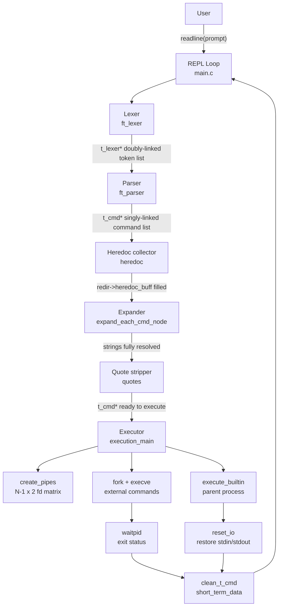

# Minishell

> A POSIX-compliant Unix shell implemented in C from scratch — featuring a four-stage compiler pipeline, full process management, here-documents, and a two-tier memory ownership system. Built collaboratively over 164 commits.


---

## Table of Contents

- [Overview](#overview)
- [Engineering Highlights](#engineering-highlights)
- [System Architecture](#system-architecture)
- [Data Flow](#data-flow)
- [Central Data Structure](#central-data-structure--t_exec)
- [Key Design Decisions](#key-design-decisions)
- [Project Structure](#project-structure)
- [Getting Started](#getting-started)
- [Example Usage](#example-usage)
- [Scale & Development](#scale--development)
- [Future Improvements](#future-improvements)
- [Engineering Notes](#engineering-notes)
- [License](#license)

---

## Overview

Minishell is a Unix shell implemented in C that reproduces the core behaviour of Bash: command parsing, pipelines, I/O redirection, environment expansion, here-documents, and built-in commands — with no shell libraries beyond `readline`.

The implementation focuses on the systems-level concerns behind shell design: explicit process management, file descriptor ownership, signal handling, and deterministic memory lifetimes.

Internally the shell is structured as a **four-stage compiler-style pipeline**:

```
lexer → parser → expander → executor
```

Memory ownership is handled using a **two-tier cleanup model**:
- `short_term_data` — allocations tied to a single command line
- `long_term_data` — allocations that persist for the entire shell session

---

## Engineering Highlights

| Concern | What the implementation actually does |
|---|---|
| **Pipeline execution** | Allocates an `N-1 × 2` pipe fd matrix upfront; wires each command's stdin/stdout via `dup2` before fork; children call `close_open_pipes` to release fds they don't own, preventing deadlocks |
| **Built-in isolation** | Built-ins run in the **parent process** to mutate shell state (`cd`, `export`, `unset`); parent I/O is temporarily redirected via `dup2`, then restored from saved duplicates |
| **Variable expansion** | Character-by-character scan with a **quote-state bitmask**; handles `$VAR`, `${VAR}`, `$?`, `$$` (PID); bad `${}` syntax sets a `bad_substitution` flag without aborting the parse |
| **Here-documents** | Collected via `readline` before execution begins; `$` expansion runs inside the heredoc with its own quote rules; content stored in `redir->heredoc_buff`, written to a pipe at execution time — no temp files |
| **Signal handling** | `SIGINT` at the prompt calls `rl_on_new_line` + `rl_replace_line` + `rl_redisplay` to mirror bash exactly; disposition is reset to default in children so `Ctrl+C` terminates the foreground group |
| **Memory management** | Every `malloc` is registered into a `t_list` cleanup chain at allocation time; `short_term_data` freed per command line, `long_term_data` freed on exit; no ad-hoc `free` chains scattered across error branches |
| **PATH resolution** | `get_cmd_path_for_exec` splits `PATH` on `:`, probes each directory with `access(F_OK \| X_OK)`, passes the resolved absolute path directly to `execve` |
| **Exit status propagation** | `waitpid` with `WIFEXITED` / `WIFSIGNALED` extracts the child's status; only the **last** non-builtin command in a pipeline updates `g_exit_status`; `$?` resolves to this value at expansion time |

---

## System Architecture

Minishell follows a **classic compiler front-end / back-end split** applied to shell input. Every line the user enters travels through four sequential stages before a single process is spawned.



**Stage 1 — Lexer (`srcs/lexer/`)**
Tokenises the raw input string into a **doubly-linked list of `t_lexer` nodes**. Each node holds a string and a token type: `WORD`, `PIPE`, `INFILE`, `OUTFILE`, `APPEND`, `HEREDOC`, `RDWR`. Quote characters are detected but preserved — they are meaningful to later stages. Whitespace is consumed but not emitted.

**Stage 2 — Parser (`srcs/parser/`)**
Runs `ft_check_syntax` first: rejects leading `|`, consecutive `||`, redirections without a following word, and malformed redirection sequences. If valid, converts the token list into a **singly-linked list of `t_cmd` nodes**, each carrying a `char **array` of arguments and a `t_redir *` chain of redirections.

**Stage 3 — Expander (`srcs/expander/`)**
Walks every string in every `t_cmd` and `t_redir` node in three passes:
1. **Dollar expansion** (`expand_dollar`): resolves `$VAR`, `${VAR}`, `$?`, and `$$`; sets `cmd->bad_substitution = TRUE` on malformed `${}` without aborting.
2. **Here-document collection** (`heredoc`): runs `readline` until the delimiter is matched, expanding `$` inside the buffer; stores the result in `redir->heredoc_buff`.
3. **Quote stripping** (`quotes` / `trim_quote`): removes quote characters after expansion semantics have been honoured.

**Stage 4 — Executor (`srcs/executor/`)**
Creates all pipes upfront, forks children, wires file descriptors, and either `execve`s external commands or runs built-ins directly in the parent. Owns the pipe matrix, child PID array, I/O save/restore, and exit status collection.

---

## Data Flow

What happens when the user types `cat file.txt | grep foo | wc -l`:

1. `readline` returns the raw string, added to history and stored in `ex->args`.
2. `ft_lexer` produces: `[WORD:"cat"] [WORD:"file.txt"] [PIPE] [WORD:"grep"] [WORD:"foo"] [PIPE] [WORD:"wc"] [WORD:"-l"]`
3. `ft_check_syntax` validates. `ft_parser` builds three `t_cmd` nodes linked by `->next`.
4. `heredoc` scans the `t_redir` chains — no `HEREDOC` tokens, returns immediately.
5. `expand_each_cmd_node` and `quotes` walk every string — no `$` or quotes, nothing changes.
6. `execution_main` is called:
   - `create_pipes` allocates a `2 × 2` fd matrix and calls `pipe()` twice.
   - `create_child_ids` allocates an int array of size 3.
   - `process_cmds` iterates the command list:
     - **`cat file.txt`:** `save_original_io` saves stdin/stdout. `dup_pipes` wires `fd[0][WRITE]` → `STDOUT`. `fork` → child closes remaining pipe ends, resolves `cat` via PATH, calls `execve`. Parent calls `reset_io`.
     - **`grep foo`:** `dup_pipes` wires `fd[0][READ]` → `STDIN` and `fd[1][WRITE]` → `STDOUT`. `fork` → child calls `execve`. Parent calls `reset_io`.
     - **`wc -l`:** `dup_pipes` wires `fd[1][READ]` → `STDIN`. No `->next`, stdout unchanged. `fork` → child calls `execve`. Parent calls `reset_io`.
   - `wait_for_child_exit_status` collects all three PIDs. Exit status of `wc -l` written to `g_exit_status`.
   - `close_all_pipes` and `clean_list(short_term_data)` free all per-line resources.
7. The REPL loops and `readline` displays the next prompt.

---

## Central Data Structure — `t_exec`

A single `t_exec` struct allocated once at startup and threaded through every stage as a single source of truth:

```c
typedef struct s_exec
{
    char     *args;             // raw input line from readline
    t_lexer  *lexer;            // token list produced by the lexer
    t_cmd    *cmd;              // command list produced by the parser
    char     **env;             // inherited environment as char array
    t_list   *env_list;         // live environment as KEY=VALUE linked list
    int      **fd;              // pipe fd matrix: [total_pipes][2]
    int      *id;               // child PIDs, one per non-builtin command
    int      total_pipes;       // number of active pipes
    int      total_children;    // number of forked children
    int      stdin_original;    // saved real stdin fd
    int      stdout_original;   // saved real stdout fd
    t_list   *short_term_data;  // allocations freed after each command line
    t_list   *long_term_data;   // allocations freed on shell exit
    int      is_builtin_last;   // TRUE if last cmd is a builtin (affects $?)
    char     *path;             // resolved executable path
}   t_exec;
```

No stage receives raw pointers directly — all receive `t_exec *ex` and access only what they need. This makes the data flow auditable and prevents cross-stage coupling.

---

## Key Design Decisions

### Built-ins execute in the parent process

`cd`, `export`, `unset`, and `exit` must mutate the shell's own state. Running them in a child would leave the parent's working directory, environment, and exit status unchanged. The executor checks `is_builtin()` before forking and temporarily redirects the parent's I/O via `dup2` to honour any attached redirections, restoring it immediately after.

### Pipe fds are allocated as a matrix before any fork

All `N-1` pipes are created upfront so their file descriptors are available to every child that needs to inherit them. Each child calls `close_open_pipes` to release the ends it does not own — preventing a child from blocking on a read that will never reach EOF because an unclosed write end survives in another process.

### Here-documents are fully buffered before execution

Content is collected via `readline` into `redir->heredoc_buff` before any `fork` occurs. At execution time, `write_heredoc_to_pipe` writes the buffer into an anonymous pipe and returns the read end as stdin. No temporary files, no `/tmp` cleanup, no fd lifetime complexity.

### Quote state is tracked with a bitmask

The expander tracks `single_quotes` and `double_quotes` as two independent integer flags toggled by XOR (`sq ^= 1`). A `$` is only expanded when `sq == CLOSED`. This naturally handles nested quote contexts without a state machine.

### Two-tier memory management

Every `malloc` result is immediately registered into either `short_term_data` (per command-line lifetime) or `long_term_data` (session lifetime) via `add_data_to_cleanup_list`. A single `clean_list` call frees everything in the appropriate tier — no ad-hoc `free` calls scattered across error branches.

---

## Project Structure

```
minishell-42/
├── includes/
│   ├── minishell.h          # Top-level include, extern g_exit_status
│   ├── executor.h           # All structs: t_exec, t_cmd, t_redir, t_lexer,
│   │                        #   t_token_type — and all prototypes
│   ├── expander.h
│   ├── lexer.h
│   ├── parser.h
│   ├── builtins.h
│   ├── utils.h
│   └── messages.h           # Error string constants
├── srcs/
│   ├── main.c               # REPL loop, prompt construction, entry point
│   ├── signals.c            # SIGINT/SIGQUIT handlers, ft_init_signals
│   ├── lexer/               # Raw string → t_lexer doubly-linked token list
│   │   ├── main.c           # ft_lexer: tokenisation loop
│   │   ├── init.c           # t_lexer node allocation
│   │   ├── utils.c          # Token type detection, word extraction
│   │   ├── clean.c          # ft_free_lexer
│   │   └── debug.c          # Debug helpers (disabled in release)
│   ├── parser/              # Token list → t_cmd list + syntax validation
│   │   ├── main.c           # ft_parser entry point
│   │   ├── syntax.c         # ft_check_syntax: validates token sequences
│   │   ├── init.c           # t_cmd and t_redir node construction
│   │   ├── quotes.c         # Quote-stripping pass
│   │   └── error.c          # ft_parser_error, ft_syntax_error
│   ├── expander/            # String expansion and heredoc collection
│   │   ├── expander.c       # expand_each_cmd_node: drives per-node expansion
│   │   ├── dollar.c         # expand_dollar: $VAR / ${VAR} / $? / $$ resolution
│   │   ├── dollar_utils.c   # curly bracket handling, quote-state helpers
│   │   ├── heredoc.c        # open_heredoc: readline loop + $ expansion
│   │   └── trim.c           # trim_quote: quote character removal
│   ├── executor/            # Process creation, pipe wiring, execution
│   │   ├── executor.c       # execution_main + process_cmds loop
│   │   ├── executor_utils.c # execute_command: fork + PATH resolution + execve
│   │   ├── init.c           # initialize_minishell, initialize_execution
│   │   ├── pipes.c          # create_pipes, dup_pipes, close helpers
│   │   ├── input_output.c   # save_original_io, reset_io
│   │   ├── file_redirection.c # open_file, dup_file_input/output, heredoc pipe
│   │   ├── error.c          # execution error reporting
│   │   └── shlvl.c          # SHLVL increment/decrement
│   ├── builtins/            # Built-in command implementations
│   │   ├── builtin.c        # is_builtin() + execute_builtin() dispatch
│   │   ├── cd.c             # cd: no args, .., -, and path forms
│   │   ├── echo.c           # echo with -n flag
│   │   ├── env.c            # env: print current environment
│   │   ├── export.c         # export: validation, alphabetic print, update
│   │   ├── unset.c          # unset: remove variable from env_list
│   │   ├── pwd.c            # pwd: getcwd wrapper
│   │   └── exit.c           # exit: numeric argument validation + cleanup
│   └── utils/               # Shared helpers used across all modules
│       ├── ft_lists.c       # new_node, get_last_node, delete_node
│       ├── ft_env.c         # get_env_value, get_env_node
│       ├── ft_clean.c       # add_data_to_cleanup_list, clean_list
│       ├── ft_error.c       # print_error, malloc_error
│       ├── ft_functions.c   # free_data, skip_whitespace, has_pipe
│       ├── ft_join_3_strings.c
│       └── ft_list_to_str_array.c  # env_list → char** for execve
└── libs/
    └── libft/               # Custom libc subset: string, memory, I/O utilities
```

---

## Getting Started

### Requirements

- GCC ≥ 9 or Clang ≥ 10
- GNU Make
- GNU Readline development headers

```sh
# Debian / Ubuntu
sudo apt install build-essential libreadline-dev

# macOS (Homebrew)
brew install readline
```

### Build & Run

```sh
git clone https://github.com/artclave/minishell-42.git
cd minishell-42
make
./minishell
```

```sh
make clean    # remove object files
make fclean   # remove object files and binary
make re       # fclean + full rebuild
```

---

## Example Usage

```sh
# Deep pipeline
cat /etc/passwd | grep root | cut -d: -f1 | wc -c

# All redirection forms
echo "header" > out.txt
cat < out.txt >> log.txt
cat << EOF
line one
line two
EOF

# Variable expansion and exit status
export GREETING="hello"
echo "$GREETING, $USER — shell PID is $$"
false
echo $?                  # 1

# Built-in behaviour
cd ~
pwd
export MY_VAR="42"
unset MY_VAR
env | grep MY_VAR        # no output

# Quote rules
echo '$USER'             # literal: $USER
echo "$USER"             # expanded: artclave
```

---

## Scale & Development

This is a collaborative project built over **164 commits** across a 2-month development period, including **96 bug-fix commits** targeting edge cases across every subsystem — signal handling races, pipe fd leaks, quote-state corruption, heredoc expansion rules, and `waitpid` exit-code extraction. The implementation spans **51 source files** and **4,423 lines of C**.

---

## Future Improvements

- **Subshell support** `(cmd1; cmd2)` — spawn a child that runs its own REPL iteration
- **Wildcard / glob expansion** — `*` and `?` matching via `opendir`/`readdir`
- **Job control** — background execution (`&`), `fg`/`bg`, `SIGTSTP`
- **Logical operators** — `&&` and `||` short-circuit evaluation
- **`sigaction` instead of `signal`** — fully async-signal-safe handlers
- **Integration test suite** — automated comparison against a reference `bash` invocation for every supported construct

---

## Engineering Notes

### File descriptor ownership must be explicit at every process boundary

A single unclosed write-end of a pipe surviving in the parent stalls the entire pipeline — the downstream reader blocks waiting for an EOF that never arrives. The solution is `close_open_pipes` called in every child immediately after `fork`, combined with `close_all_pipes` in the parent after all children are spawned. Every fd must be accounted for, in every process, at every point in the lifecycle.

### Built-ins require a split execution path by design

`cd`, `export`, `unset`, and `exit` operate on the shell's own process state. Forking them into a child makes their effects invisible to the parent. The executor maintains two distinct paths: `fork` + `execve` for external commands, and in-parent execution for built-ins with temporary `dup2`-based I/O redirection restored via `reset_io`. The distinction is determined by `is_builtin()` before any process is created.

### Expansion order is a correctness constraint, not a style choice

Dollar expansion, heredoc expansion, and quote stripping must occur in a fixed sequence with consistent quote-context state. Running them out of order or in a single pass produces incorrect results for inputs like `"$VAR"`, `'$VAR'`, and `"$VAR"'$VAR'`. The implementation enforces this as separate sequential passes — each with its own quote-state bitmask.

### Registering allocations at malloc time eliminates error-path leaks

The conventional approach of freeing at each error branch requires every future code change to update every error path. The two-tier cleanup model inverts this: each pointer is registered immediately after allocation, and a single `clean_list` call frees everything. Error branches require no free logic of their own.

### Signal disposition is process-scoped and must be managed across `fork`

`SIGINT` at the interactive prompt must redraw the readline line without exiting. The same signal delivered to a running child must terminate it. These incompatible behaviours require disposition to be explicitly set in the parent before `fork` and reset to `SIG_DFL` in the child before `execve`.

---

## License

This project is licensed under the MIT License. See [LICENSE](./LICENSE) for details.

---

[↑ Back to top](#minishell)
